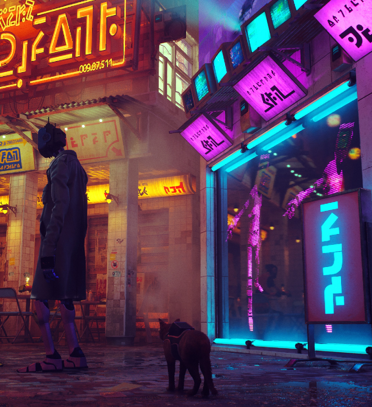
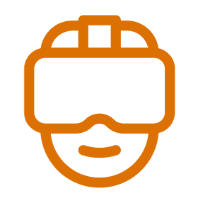
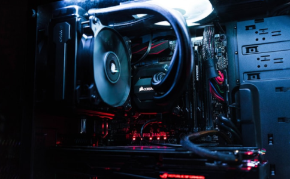
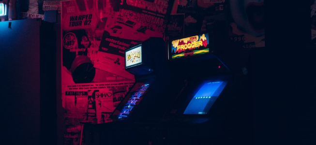

# Open Props
[](https://open-props.style/#getting-started)

OpenProps é uma biblioteca de CSS Custom Properties (também conhecidas como CSS variáveis) que fornece um conjunto de propriedades pré-definidas para ajudar a acelerar o desenvolvimento de designs responsivos e consistentes.

## Projeto 
 O nosso projeto web é uma emocionante jornada de aprendizado, focada na criação de uma página dedicada aos amantes de jogos. Desenvolvida utilizando as tecnologias web fundamentais, a iniciativa visa explorar e entender o poder do OpenProps.

 ## Tecnologias Utilizadas

- HTML
- CSS
- [Open Props](https://open-props.style/)


## Instalação

Para instalar o OpenProps é bastante simples.
Primeiro na sua pagina HTML ira colar o link abaixo no seu 'head' :

```bash
<link rel="stylesheet" href="https://unpkg.com/open-props"/>
```
Apos isso terá que ir no seu arquivo CSS, e importar para começo da codigo dessa forma abaixo:
```bash
 @import "https://unpkg.com/open-props"; 
```
  Apos isso o OpenProps ja esta instalado agora é usar suas funcionalidades da forma que preferir.
# Passo a Passo do Desenvolvimento da Página 
## **Estrutura Inicial do HTML**

Comece com a estrutura básica do HTML, adicionando as tags essenciais, como <html>, <head>, e <body>. Insira também os metadados necessários, como charset e viewport.

```html
<!DOCTYPE html>
<html lang="pt-br">
<head>
    <meta charset="UTF-8">
    <meta name="viewport" content="width=device-width, initial-scale=1.0">
    <!-- Inclusão de Open Props CDN -->
    <link rel="stylesheet" href="https://unpkg.com/open-props"/>
    <!-- Estilos página -->
    <link rel="stylesheet" href="css/styles.css">
    <title>Open Props Project</title>
</head>

```

### **Cabeçalho da Página**

Adicione o cabeçalho da página, incluindo a navegação e o logotipo.


```html
    <div>
        <header>
            <nav class="header-nav">
                <a href=""></a>
                <ul class="header-nav-ul">
                    <li><a href="#">Home</a></li>
                    <li><a href="">About us</a></li>
                    <li><a href="#">Portfolio</a></li>
                    <li><a href="#">News</a></li>
                    <li><a href=""><button>Contact us</button></a></li>
                </ul>
            </nav>
        </header>


```

### **Seção de Destaque**

Inclua a seção destacada com uma breve descrição e botão para mais detalhes.


```html
            <div class="tituloPrincipal">
               <p id="p1">3D game Dev</p>
               <p id="p2">Work that we<br> produce for our<br> clients</p>
               <p id="p3">Lorem Ipsum is simply dummy text of the printing and<br> typesetting industry. Lorem Ipsum has been the industry's<br> standard.</p>
               <button>Get more details</button>
            </div>
        </div>


```
### **Seção de Jogos em Destaque**

Adicione a seção que destaca os jogos populares.

```html
        <section class="container">
            <div id="topcard">
                <h3>Currently Trending Games</h1>
                <button id="seeall">SEE ALL</button>
            </div>
            <div id="cards">
    
                <div class="card">
                    
                    <div id="rodapecard">
                        <i class="fa-solid fa-fire"></i>
                        <span>40 Followers</span>
                    </div>
                </div>  
                <div class="card">
                    
                    <div id="rodapecard">
                        <i class="fa-solid fa-fire"></i>
                        <span>40 Followers</span>
                    </div>
                </div>
                <div class="card">
                    
                    <div id="rodapecard">
                        <i class="fa-solid fa-fire"></i>
                        <span>40 Followers</span>
                    </div>
                </div>
                  <div class="card">
                    
                    <div id="rodapecard">
                        <i class="fa-solid fa-fire"></i>
                        <span> 40 Followers</span>
                    </div>
                </div>
         
                </div>
            </div>

 </section>
```
Lembre-se de adicionar os estilos adequados para esta seção em seu arquivo CSS.


### **Seção de Informações sobre Jogos**

Inclua uma seção com informações sobre a indústria de jogos.


```html
        <section class="container">
            <h1>Lorem Ipsum</h1>
            <p>Lorem Ipsum is simply dummy text of the printing and typesetting industry. Lorem Ipsum has been the industry's standard dummy text ever since the 1500s,</p>
            
        </section>


```
### **Seção de Serviços**

Adicione uma seção que destaca diferentes serviços relacionados a jogos.


```html
         <section class="container">
        <h1>Lorem Ipsum is simply dummy text of the printing and typesetting industry.</h1>
        <p>Lorem Ipsum is simply dummy text of the printing and typesetting industry. Lorem Ipsum has been the industry's standard dummy text ever since the 1500s,</p>
        <div>
            <div>
                
               <p>Mobile Game Development</p>
               <i class="fa-solid fa-arrow-right"></i>
            </div>
            <div>
                
                <p>PC Game Development</p>
                <i class="fa-solid fa-arrow-right"></i>
            </div>
            <div>
                
                <p>PS4 Game Development</p>
                <i class="fa-solid fa-arrow-right"></i>
            </div>
            <div>
                
                <p>AR/VR Solutions</p>
                <i class="fa-solid fa-arrow-right"></i>
            </div>
            <div>
                
                <p>AR/ VR design</p>
                <i class="fa-solid fa-arrow-right"></i>
            </div>
            <div>
                
                <p>3D Modelings</p>
                <i class="fa-solid fa-arrow-right"></i>
            </div>
        </div>
    </section>


```
### **Seção de Projetos Recentes**

Inclua uma seção que destaca os projetos mais recentes.


```html
        <section  class="container">
        <h1>Our Recent Projects</h1>
        <p>Lorem Ipsum is simply dummy text of the printing and typesetting industry. </p>
        <div class="galeria">
            <div class="imagem">
                
            </div>
            <div class="imagem">
                
            </div>
            <div class="imagem">
                
            </div>
            <div class="imagem">
                
            </div>
            <div class="imagem">
                
            </div>
            <div class="imagem">
                
            </div>
        </div>
        <button>See all</button>
    </section>


```
### **Seção de Assinatura**

Adicione uma seção para que os visitantes possam se inscrever para receber atualizações.

```html
         <section class="container">
        <h1>Lorem Ipsum</h1>
        <p>Lorem Ipsum is simply dummy text of the printing and typesetting industry. </p>
        <div>
            <p>Stay in the loop</p>
            <p>Subscribe to receive the latest news and updates about TDA. We promise not to spam you! </p>
        </div>
        <div>
            <input type="text" placeholder="Enter your address">
            <button>Continue</button>
        </div>
    </section>

```
### **Rodapé**

Por fim, adicione o rodapé da página.


```html
 <footer>
        <div  class="footerElement container">
            <div class="item" id="info">
                
                <p>Lorem Ipsum is simply dummy text of the printing and typesetting industry. </p>
                <p>@logo</p>
            </div>
            <div class="item" id="about">
                <h2>About us</h2>
                <ul>
                    <li><a href="#">Zeux</a></li>
                    <li><a href="#">Portfolio</a></li>
                    <li><a href="#">Careers</a></li>
                    <li><a href="#">Contact us</a></li>
                </ul>
            </div>
            <div class="item" id="contact">
                <h2>Contact us</h2>
                <p>Lorem Ipsum is simply dummy text of the printing and typesetting industry. </p>
                <p>+908 89097 890</p>
            </div>
            <div class="item" id="sociasMedias">
                <div id="item">
                    <a href=""><i class="fa-brands fa-facebook"></i></a>
                </div>
                <div id="item">
                    <a href=""><i class="fa-brands fa-instagram"></i></a>
                </div>
                <div id="item">
                    <a href=""><i class="fa-brands fa-twitter"></i></a>
                </div>
                <div id="item">
                    <a href=""><i class="fa-brands fa-linkedin"></i></a>
                </div>
            </div>
        </div>
        <hr class="line">
        <div class="copy">
            <p>Copyright ® 2024 Lorem All rights Rcerved</p>
        </div>
    </footer>
</body>
<script src="https://kit.fontawesome.com/4f7465debd.js" crossorigin="anonymous"></script>
</html>


```
Agora sua pagina HTML está pronta.

## **Estrutura Inicial do CSS** 
Vamos agora criar o arquivo de estilo CSS (styles.css) passo a passo para estilizar a página que estamos desenvolvendo.

### **Estilos Globais e Importações Externas**
No início do arquivo css/styles.css, adicione os estilos globais e importações externas:

```css
@import url('https://fonts.googleapis.com/css2?family=Palanquin:wght@500&family=Poppins:wght@300&display=swap');
@import "https://unpkg.com/open-props";
@import "https://unpkg.com/open-props/normalize.min.css";
@import "open-props/colors-hsl";

* {
    padding: var(--size-fluid-0);
    margin: var(--size-fluid-0);
    box-sizing: border-box;
    font-family: var(--font-sans);
    list-style: none;
    text-decoration: none;
    font-family: 'Poppins', sans-serif;
}


```

### **Estilos para a Seção Principal (main)**
Estilize a seção principal:


```css
main {
    background: linear-gradient(#010101, #1a0e01);
}


```

### **Estilos para a Classe .container**
Estilize a classe .container:

```css
.container {
    width: 80%;
    margin: 0 auto;
    padding: 0px 20px 20px 20px;
    box-sizing: border-box;
}


```

### **Estilos para o Cabeçalho (header-nav)**
Estilize o cabeçalho da página:


```css
.header-nav {
    display: flex;
    justify-content: space-between;
    align-items: center;
    padding-top: var(--size-fluid-1);
}


```

### **Estilos para os Elementos do Cabeçalho (header-nav-ul, .header-nav-ul a, .icon, .headerBtn)**
Estilize os elementos do cabeçalho:


```css
.header-nav-ul {
    display: flex;
    justify-content: space-between;
}

.header-nav-ul a {
    padding: var(--size-4) var(--size-4) var(--size-4) var(--size-4);
    color: var(--gray-0);
    font-size: var(--font-size-1);
}

.icon {
    color: var(--gray-0);
    display: none;
}

.headerBtn {
    background-color: var(--yellow-7);
    padding-inline-end: 20px;
    padding-inline-start: 20px;
    padding-top: 3px;
    padding-bottom: 3px;
    border-radius: var(--radius-2);
}

.headerBtn:hover {
    background-color: var(--blue-3);
}


```
### **Estilos para a Seção Principal do Título (tituloPrincipal)**
Estilize a seção principal do título:


```css
.tituloPrincipal {
    padding: var(--size-fluid-5) 0 var(--size-fluid-5) 0;
}


```
### **Estilos para os Elementos do Título Principal (p1, p2, p3, .tituloPrincipal p, tituloPrincipal button)**
Estilize os elementos do título principal:


```css
#p1 {
    color: var(--yellow-7);
    font-weight: var(--font-weight-4);
    padding-top: var(--size-3);
    padding-bottom: var(--size-3);
    margin: 0;
}

.tituloPrincipal p {
    color: var(--gray-0);
}

#p2 {
    font-size: var(--font-size-7);
    font-weight: var(--font-weight-9);
    line-height: var(--font-lineheight-3);
}

#p3 {
    font-size: var(--font-size-1);
    padding: var(--size-4) 0 var(--size-4) 0;
    line-height: var(--font-lineheight-3);
}

.tituloPrincipal button {
    background-color: var(--yellow-7);
    color: var(--gray-0);
    padding-inline-start: var(--size-fluid-2);
    padding-inline-end: var(--size-fluid-2);
    padding-top: .5rem;
    padding-bottom: .5rem;
    border-radius: var(--radius-4);
    margin-top: var(--size-4);
    margin-bottom: var(--size-4);
}

.tituloPrincipal button:hover {
    background-color: var(--yellow-9);
}

```
### **Estilos para as Imagens (joystick, .unity)**
Estilize as imagens:

```css
.joystick {
    position: absolute;
    left: 52%;
}

.unity {
    position: absolute;
    width: 100px;
}


```
### **Estilos para a Seção de Cartões (topcard, seeall, cards, .card, img, span, h3, i)**
Estilize a classe .container:

```css
#topcard {
    display: flex;
    align-items: baseline;
    padding: var(--size-);
    justify-content: space-between;
    width: 89%;
    padding: var(--size-2);
}

#seeall {
    border-radius: var(--radius-2);
    padding: var(--size-fluid-1);
    background-color: #3b322add;
}

#cards {
    display: flex;
    flex-flow: row wrap;
    align-items: flex-start;
    justify-content: space-around;
    max-inline-size: calc(var(--size-content-1) * 5);
    gap: var(--size-2);
    padding: var(--size-5);
}

.card {
    flex-basis: var(--size-content-1);
    display: flex;
    flex-direction: column;
    gap: var(--size-2);
    border: 1px solid var(--surface-1);
    border-radius: var(--radius-2);
    box-shadow

```


## Autores

- [@ThaylonDEVV](https://github.com/ThaylonDEVV)
- [@Gregory2786](https://github.com/Gregory2786)
- [@jonatasprocha](https://github.com/jonatasprocha)


