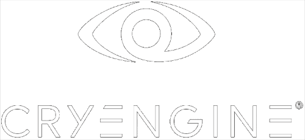
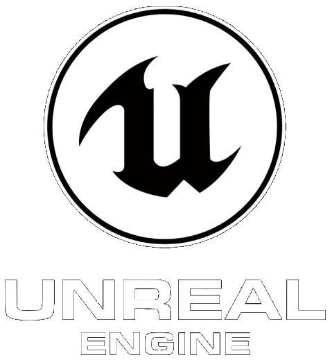

# Open Props
[](https://open-props.style/#getting-started)

OpenProps é uma biblioteca de CSS Custom Properties (também conhecidas como CSS variáveis) que fornece um conjunto de propriedades pré-definidas para ajudar a acelerar o desenvolvimento de designs responsivos e consistentes.

## Projeto 
 O nosso projeto web é uma emocionante jornada de aprendizado, focada na criação de uma página dedicada aos amantes de jogos. Desenvolvida utilizando as tecnologias web fundamentais, a iniciativa visa explorar e entender o poder do OpenProps.

 ## Tecnologias Utilizadas

- HTML
- CSS
- [Open Props](https://open-props.style/)


## Instalação

Para instalar o OpenProps é bastante simples.
Primeiro na sua pagina HTML ira colar o link abaixo no seu 'head' :

```bash
<link rel="stylesheet" href="https://unpkg.com/open-props"/>
```
Apos isso terá que ir no seu arquivo CSS, e importar para começo da codigo dessa forma abaixo:
```bash
 @import "https://unpkg.com/open-props"; 
```
  Apos isso o OpenProps ja esta instalado agora é usar suas funcionalidades da forma que preferir.
# Passo a Passo do Desenvolvimento da Página 
## **Estrutura Inicial do HTML**

Comece com a estrutura básica do HTML, adicionando as tags essenciais, como <html>, <head>, e <body>. Insira também os metadados necessários, como charset e viewport.

```html
<!DOCTYPE html>
<html lang="pt-br">
<head>
    <meta charset="UTF-8">
    <meta name="viewport" content="width=device-width, initial-scale=1.0">
    <!-- Inclusão de Open Props CDN -->
    <link rel="stylesheet" href="https://unpkg.com/open-props"/>
    <!-- Estilos página -->
    <link rel="stylesheet" href="css/styles.css">
    <title>Open Props Project</title>
</head>

```

### **Cabeçalho da Página**

Adicione o cabeçalho da página, incluindo a navegação e o logotipo.


```html
    <div>
        <header>
            <nav class="header-nav">
                <a href=""></a>
                <ul class="header-nav-ul">
                    <li><a href="#">Home</a></li>
                    <li><a href="">About us</a></li>
                    <li><a href="#">Portfolio</a></li>
                    <li><a href="#">News</a></li>
                    <li><a href=""><button>Contact us</button></a></li>
                </ul>
            </nav>
        </header>


```

### **Seção de Destaque**

Inclua a seção destacada com uma breve descrição e botão para mais detalhes.


```html
            <div>
           <span>3D game Dev</span>
           <p>Work that we produce for our clients</p>
           <p>Lorem Ipsum is simply dummy text of the printing and typesetting industry. Lorem Ipsum has been the industry's standard.</p>
           <button>Get more details</button>
        </div>
        <div>
            
            
            
            
        </div>
    </div>


```
### **Seção de Jogos em Destaque**

Adicione a seção que destaca os jogos populares.

```html
        <section>
        <div id="topcard">
            <h1>Currently Trending Games</h1>
            <button id="seeall">See all</button>
        </div>
        <div id="cards">
            <!-- Adicione os cartões de jogos aqui -->
        </div>
    </section>


```
Lembre-se de adicionar os estilos adequados para esta seção em seu arquivo CSS.


### **Seção de Informações sobre Jogos**

Inclua uma seção com informações sobre a indústria de jogos.


```html
        <section>
        <h1>Lorem Ipsum</h1>
        <p>Lorem Ipsum is simply dummy text of the printing and typesetting industry. Lorem Ipsum has been the industry's standard dummy text ever since the 1500s,</p>
        
    </section>


```
### **Seção de Serviços**

Adicione uma seção que destaca diferentes serviços relacionados a jogos.


```html
        <section>
        <h1>Lorem Ipsum is simply dummy text of the printing and typesetting industry.</h1>
        <p>Lorem Ipsum is simply dummy text of the printing and typesetting industry. Lorem Ipsum has been the industry's standard dummy text ever since the 1500s,</p>
        <div>
            <!-- Adicione os serviços aqui -->
        </div>
    </section>


```
### **Seção de Projetos Recentes**

Inclua uma seção que destaca os projetos mais recentes.


```html
        <section>
        <h1>Our Recent Projects</h1>
        <p>Lorem Ipsum is simply dummy text of the printing and typesetting industry. </p>
        <div>
            <!-- Adicione as imagens dos projetos recentes aqui -->
        </div>
        <button>See all</button>
    </section>


```
### **Seção de Assinatura**

Adicione uma seção para que os visitantes possam se inscrever para receber atualizações.

```html
        <section>
        <h1>Lorem Ipsum</h1>
        <p>Lorem Ipsum is simply dummy text of the printing and typesetting industry. </p>
        <div>
            <p>Stay in the loop</p>
            <p>Subscribe to receive the latest news and updates about TDA. We promise not to spam you! </p>
        </div>
        <div>
            <input type="text" placeholder="Enter your address">
            <button>Continue</button>
        </div>
    </section>

```
### **Rodapé**

Por fim, adicione o rodapé da página.


```html
    <footer>
        <div>
            <!-- Adicione as informações do rodapé aqui -->
        </div>
        <hr>
        <div>
            <p>Copyright ® 2021 Lorem All rights Reserved</p>
        </div>
    </footer>
</body>
<script src="https://kit.fontawesome.com/4f7465debd.js" crossorigin="anonymous"></script>
</html>


```
Agora sua pagina HTML está pronta.

## **Estrutura Inicial do CSS** 
Vamos agora criar o arquivo de estilo CSS (styles.css) passo a passo para estilizar a página que estamos desenvolvendo.

### **Estilos Globais e Importações Externas**
No início do arquivo css/styles.css, adicione os estilos globais e importações externas:

```css
@import url('https://fonts.googleapis.com/css2?family=Palanquin:wght@500&family=Poppins:wght@300&display=swap');
@import "https://unpkg.com/open-props";
@import "https://unpkg.com/open-props/normalize.min.css";

```

### **Estilo para a Seção Topo**
Estilize a seção #topcard e #seeall:

```css
#topcard {
    display: flex;
    flex-wrap: wrap;
}

#seeall {
    margin-left: 90%;
    border-radius: var(--radius-2);
    padding: var(--size-fluid-1);
}


```

### **Estilo para a Seção de Cartões**
Estilize a seção #cards e os cartões individuais .card:

```css
#cards {
    display: flex;
    flex-flow: row wrap;
    align-items: flex-start;
    justify-content: space-around;
    max-inline-size: calc(var(--size-content-1) * 5);
    gap: var(--size-2);
    padding: var(--size-5);
}

.card {
    flex-basis: var(--size-content-1);
    display: flex;
    flex-direction: column;
    gap: var(--size-2);
    background: var(--surface-1);
    border: 1px solid var(--surface-1);
    border-radius: var(--radius-2);
    box-shadow: var(--shadow-2);
}


```

### **Estilo para Elementos Gerais**
Estilize elementos gerais como *, span, body, h1, .header-nav, e .header-nav-ul:


```css
* {
    padding: var(--size-fluid-0);
    margin: var(--size-fluid-0);
    box-sizing: border-box;
    font-family: var(--font-sans);
}

span {
    margin-left: 25%;
}

body {
    font-family: 'Poppins', sans-serif;
}

h1 {
    font-size: 30px;
    word-wrap: normal;
}

.header-nav {
    display: flex;
    justify-content: space-between;
}

.header-nav-ul {
    display: flex;
    justify-content: space-around;
}


```


## Autores

- [@ThaylonDEVV](https://github.com/ThaylonDEVV)

